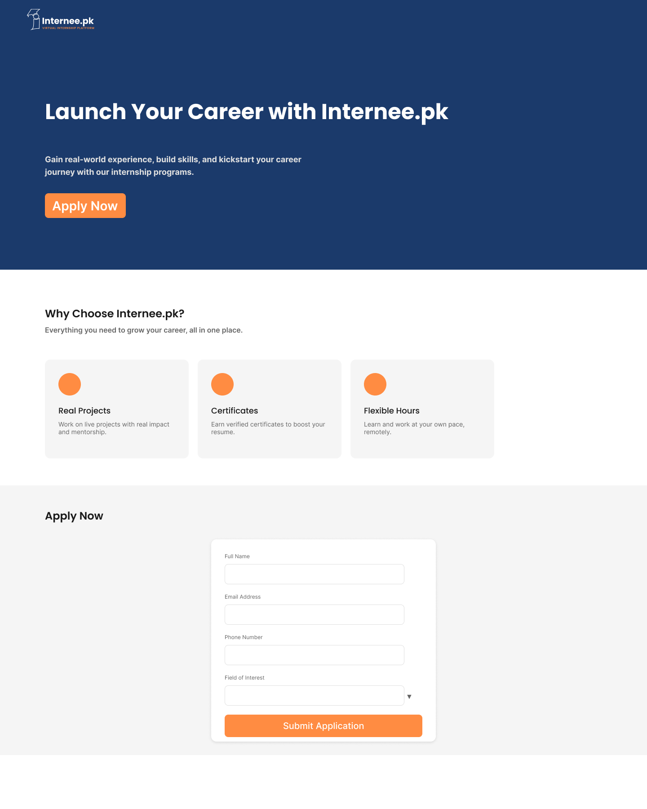

# Internee.pk Landing Page

A responsive landing page designed to showcase internship opportunities at Internee.pk.

## What's Included
- Hero section with a compelling CTA
- Program benefits section
- Application form
- Desktop and mobile responsive layouts
- Interactive prototype

## Tools Used
Figma (Responsive Grids, Prototypes)

## View the Design
🔗 [Live Figma Prototype](https://www.figma.com/design/YCdDNaXzJAwmU60cmxDzw6/Internee.pk-Landing-Page?t=71h1bRzPdyo8LRti-1)

## Preview

## About
Designed by Mazhar during a Graphic Design internship with Internee.pk (June–August 2026).
